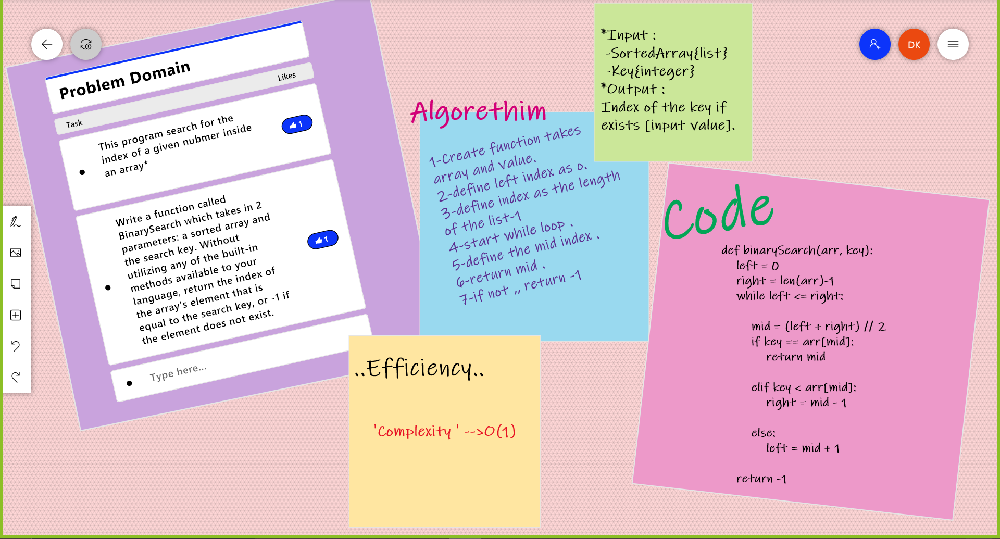

***Reverse an Array***
*This program search for the index of a given nubmer inside an array*

***Challenge***
- *Using binary search not sequentional serach*
- *this challenge are trying to let you get many solutions for 'binary-search' ..*

***Approach & Efficiency***
*Binary search takes less time than sequantional and less steps*

***Solution***
